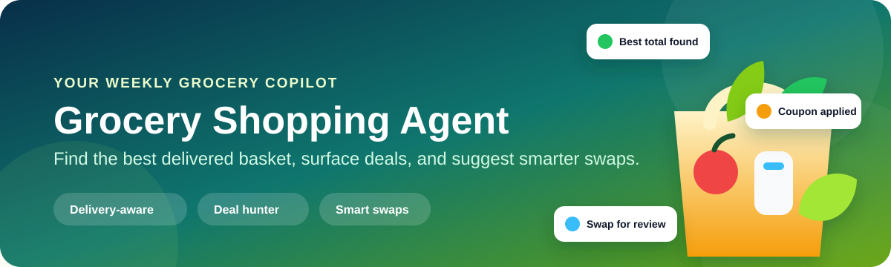
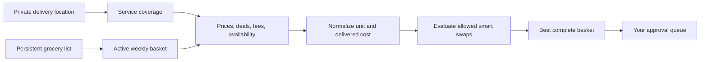

<div align="center">
  
  <h1>Grocery Shopping Agent</h1>
  <p><strong>Your grocery list, but price-aware, delivery-aware, and much less annoying.</strong></p>
  <p>
    
    
    
  </p>
</div>

This reusable Agentic Skill turns a private delivery location and grocery list into a price-aware, delivery-aware shopping review.
It checks which services appear to deliver there, compares the cost of the complete basket, surfaces current deals, and recommends better-value substitutions that follow your rules.

It prepares the basket for review.
It never places the order or touches payment information by default.

## The fun part

| You tell it | It can do |
| --- | --- |
| "I moved. Use my new delivery address." | Load the address from a private runtime input, narrow delivery coverage, and keep the address out of saved state and logs. |
| "Find the cheapest way to get everything this week." | Compare the estimated delivered total, mandatory fees, coupons, and basket coverage instead of chasing one misleading low item price. |
| "You can swap vegetables, but never my coffee." | Automatically evaluate allowed substitutions while protecting brand locks, dietary rules, product form, quality, and size. |
| "I meal prep every Sunday." | Turn cadence and consumption rules into a review horizon and target quantities. |
| "Only show deals that are actually current." | Record the source, checked time, coupon terms, membership requirement, and confidence for each offer. |

> [!TIP]
> The cheapest product is not always the cheapest basket.
> A delivery fee, minimum-order charge, or missing item can erase the apparent savings.

## From address to a review-ready basket



The location is used only for the current research run when supplied through private runtime input.
The exact address is not written into the repository, grocery state, evidence history, screenshots, or review packet.

## A weekly review might look like this

```text
This week: 8 active items across 3 possible delivery services

Best complete basket
  Example Market Delivery                    $52.40
  Basket coverage                            8 of 8 items
  Supported coupons                          $6.00
  Checkout-only taxes and tips               Not included

Smart swap for review
  Frozen broccoli 16 oz -> store-brand 20 oz
  Estimated savings                          $1.80
  Protected rules                            Passed

Action taken
  None. Waiting for your approval.
```

The numbers above are fictional, but the comparison structure is the real output contract.

## Private location input

The public example reads the delivery address from an environment variable instead of storing it in JSON.

```json
{
  "delivery_location": {
    "input": "environment_variable",
    "environment_variable": "GROCERY_DELIVERY_ADDRESS",
    "fallback_region": "Central District, Example City",
    "storage": "runtime_only"
  }
}
```

Set `GROCERY_DELIVERY_ADDRESS` only in the private runtime that performs the coverage check.
Use a city or postal-code fallback when exact address eligibility is unnecessary.

## Quick start

1. Copy `config/grocery.example.json` to a private working location.
2. Copy `data/sample-grocery-list.json` to a private state file and replace the fictional rows.
3. Validate the examples and safety rules.

```bash
python3 scripts/validate_workspace.py
python3 -m unittest discover -s tests -v
```

4. Invoke `$grocery-shopping-agent-skill` in a ChatGPT-style skill environment.
5. In a Claude-style project, keep `CLAUDE.md` at the root and ask Claude to follow `SKILL.md`.

## Try asking it

### Build this week's basket

```text
Review my grocery list for the next seven days.
Use my private delivery location to compare services, current deals, and estimated delivered totals.
Show substitutions separately and stop at the approval queue.
```

### Change a rule

```text
Make rice recurring every two weeks.
Allow store-brand substitutions, but keep the same rice type and never reduce the total package quantity.
```

### Hunt for deals without changing the list

```text
Refresh deals for active items only.
Do not change quantities or preferred products.
Flag membership-only and checkout-only claims as unverified.
```

More prompts are available in [examples/prompts.md](examples/prompts.md).

## What the agent remembers

- Recurring, this-week, and one-time items.
- Quantity on hand, reorder threshold, cadence, and target quantity.
- Preferred specifications and attributes that a substitute must preserve.
- Whether substitutions are allowed for each item.
- Price limits and user notes.
- Prior price evidence and review history.

User-owned preferences stay separate from agent-owned research.
A price scan cannot silently rewrite what you asked to buy.

## Guardrails that matter

- No order placement, payment submission, retailer login, or account change by default.
- No exact address, access code, credentials, cookies, or payment data in saved state.
- No silent substitution when an item forbids it.
- No stale coupon presented as current.
- No "purchased" status without direct confirmation.

Read [SECURITY.md](SECURITY.md) and [references/workflow.md](references/workflow.md) before connecting external services.

## Under the hood

The skill separates durable user intent from replaceable market evidence.
It normalizes package sizes, calculates delivered unit cost, compares complete-basket coverage, evaluates substitutions, and appends evidence instead of erasing history.

See the [architecture diagram](docs/architecture.md) and [data contract](references/data-contract.md) for the deeper design.

## Related Agentic Skill

Building approval-gated tools for everyday decisions?
See the [Personal Finance Control Center](https://github.com/lukegeel101/personal-finance-agent-skill), a privacy-first Agentic Skill for reconciling financial evidence, finding recurring costs, and preparing decision-ready reviews.

## Repository map

```text
.
|-- SKILL.md                       Agent instructions
|-- CLAUDE.md                      Claude-style entrypoint
|-- agents/openai.yaml             ChatGPT/Codex metadata
|-- assets/readme-hero.svg         README artwork
|-- config/grocery.example.json    Privacy-safe configuration
|-- data/                           Fictional list and offer evidence
|-- examples/                       Prompts and a review example
|-- references/                     Workflow and data contract
|-- schemas/                        JSON schemas
|-- scripts/validate_workspace.py  Dependency-free validator
`-- tests/                          Regression tests
```

## Status

This is a reusable workflow template, not a retailer integration or autonomous purchasing bot.
Price, availability, taxes, tips, member pricing, and checkout eligibility can change and must be rechecked before purchase.

## License

MIT.
