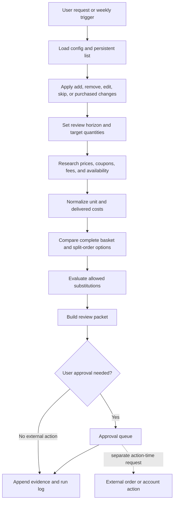

# Architecture

The workflow separates durable user intent from replaceable market evidence.
This prevents a price scan from silently changing what the user wants.



## Components

| Component | Owns | Must not own |
| --- | --- | --- |
| User state | Item intent, cadence, quantities, constraints, substitution permission | Current deal claims |
| Evidence store | Price, availability, coupon terms, source, timestamp, confidence | Credentials or payment data |
| Comparison engine | Unit-cost normalization, delivered cost, basket coverage | Silent preference changes |
| Policy engine | Substitution eligibility and approval thresholds | Checkout authority |
| Review packet | Recommendations, uncertainty, approval queue | A claim that an order was placed |

## State transitions

```text
recurring or this-week or one-time
              |
              v
           active
        /     |      \
      skip  purchased  needs-input
       |        |           |
       v        v           v
    retained  history    user review
```

Rows are retained after purchase or skip so cadence and price history remain useful.
Deletion is reserved for an explicit user request.

## Trust boundaries

Public price research may happen without retailer authentication.
Checkout-specific eligibility, account-only coupons, taxes, tips, and member pricing remain uncertain until verified.
Any order, payment, login, coupon redemption, or account change is outside the default workflow.

